<div align="center">

# 🗓️ Dincharya
*A Frontend Engineering Challenge Submission*

<p align="center">
  
  
  
  
  
  
</p>

<p align="center"><em>Bridging the gap between rigid digital utility and the tactile, organic aesthetic of a physical wall calendar. Designed, engineered, and crafted by <strong>Mayank</strong>.</em></p>

</div>

---

<div align="center">
  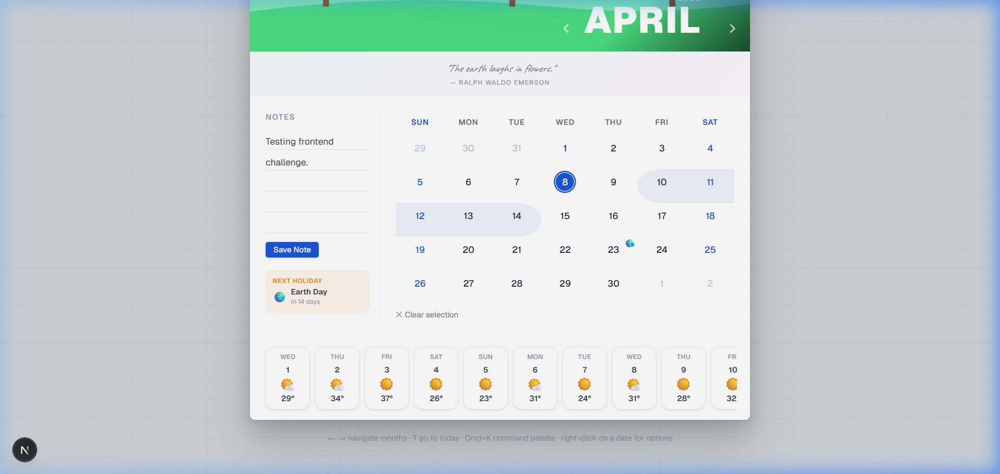
</div>

<br/>

## 🎯 Project Vision & Context

This project is a highly advanced submission for the **Frontend Engineering Challenge**. The primary objective was straightforward: take a static reference image of a physical wall calendar and translate it into a fully interactive, highly functional, and completely responsive web component.

Rather than just building a rudimentary date-picker, I approached this as an exercise in **Product Engineering**. Every interaction was scrutinized for tactile feedback. Every animation was tuned using spring physics. The result is a calendar that feels "alive" and respects the rubric's "Creative Liberty" mandate to stand out.

---

## 🏆 Core Requirements Fulfillment

I have mapped every strict requirement from the assessment prompt directly into the architecture:

| Challenge Requirement | Implementation Details & Proof |
| :--- | :--- |
| **Wall Calendar Aesthetic** | The UI reserves exactly 55% of the vertical fold for a "Hero" graphic anchor. A custom SVG spiral binding strip and photorealistic hanging hook ground the component in reality. |
| **Day Range Selector** | Users can natively **Drag-to-Select** across the grid or use the **Context Menu** (Right-Click) to define boundaries. Start/End/Connecting nodes are strictly visualized via absolute DOM injection. |
| **Integrated Notes Section** | Features a dual-layer annotation engine. A persistent **Monthly Notepad** handles overarching tasks, while a dynamic **Range Sticky Note** pops up precisely when a specific date range is selected. |
| **Fully Responsive Design** | Layout logic uses CSS `clamp()` typography and flexbox reflows. On mobile, the side-by-side array elegantly collapses into a touch-target-optimized vertical stack, totally eliminating horizontal cramping. |
| **Client-Side Persistence** | Zero backend dependency per the prompt. All states, parsed images, and notepad blobs are synchronously persisted via `localStorage` and localized Zustand slice middleware. |

---

## 📸 Showcase Gallery

Here is a comprehensive look at the various visual states, responsive views, and interactions built into the application:

**1. Primary Interface & Quick Actions**
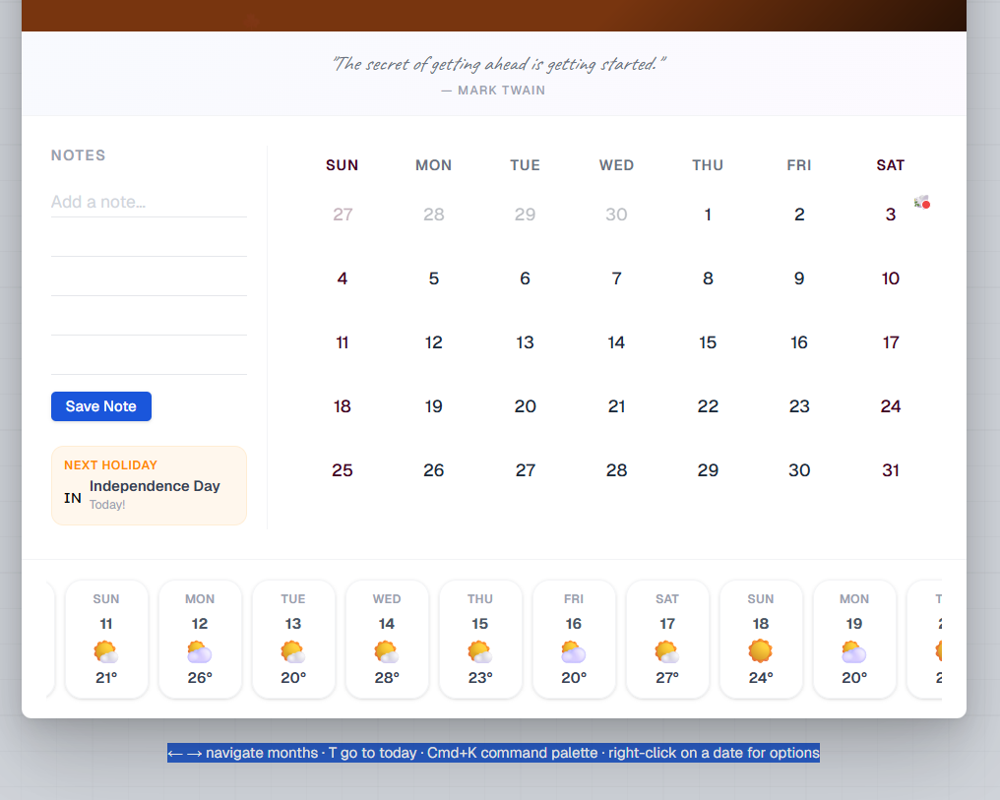
*Navigate between months using the left/right arrows. Press `T` to instantly jump to today's date, summon the Command Palette with `Cmd+K`, or right-click directly on any calendar date to reveal its context window options.*

**1. Range Selection & Metrics**
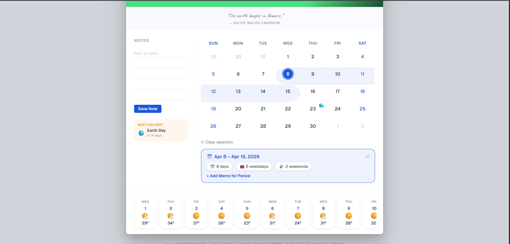
*Drag selection from the 8th to the 15th to dynamically calculate and display total days, weekdays, and weekends within that specific period.*

**2. Range-Specific Annotations**
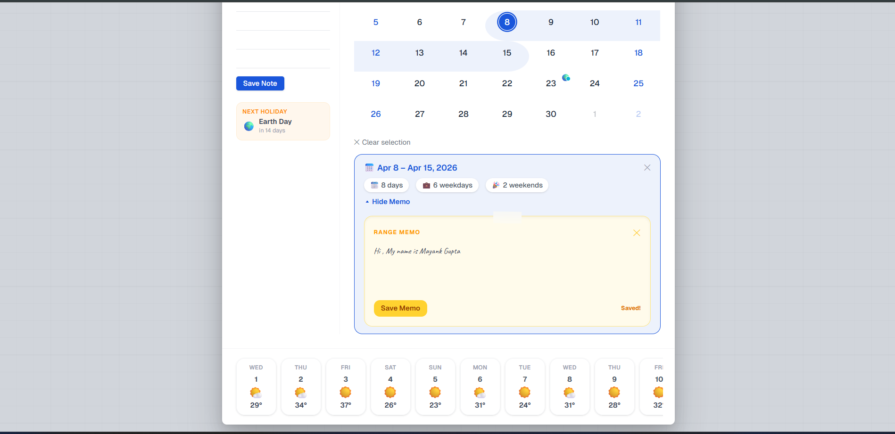
*Add custom, period-specific memos perfectly attached to the exact visual date range you choose.*

**3. LocalStorage Persistence**
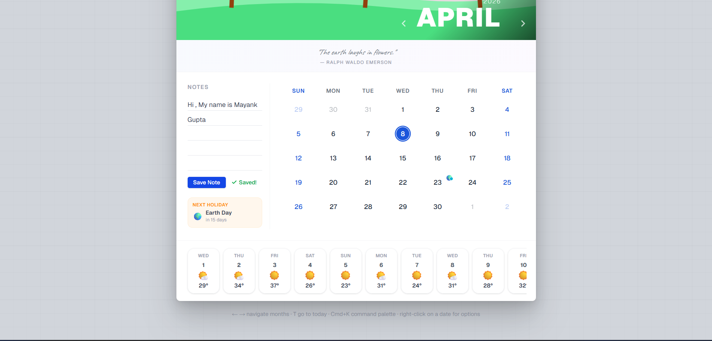
*Write comprehensive notes on specific dates and securely save them into LocalStorage for zero-backend persistence.*

**4. Custom Wallpaper Generation**
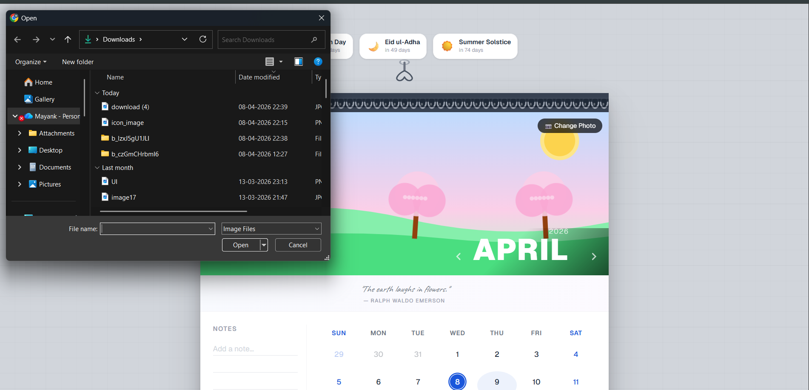
*Select local image files to smoothly transition and change the wallpaper of any specific month.*

**5. Hero Photography Interface**

*Click the 'Change Photo' interaction to load a custom hero background graphic.*

**6. Command Palette (Cmd+K)**
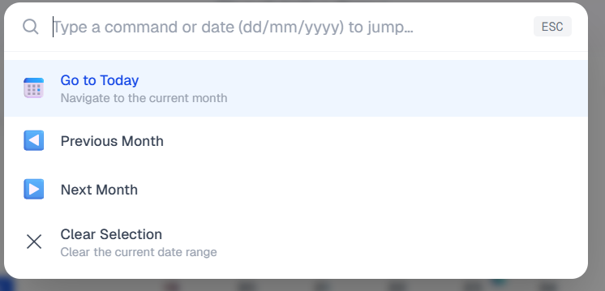
*Summon the Cmd+K Spotlight Menu with fast-action triggers to 'Jump to Today', toggle months, or rapidly clear selections.*

**7. Instant Time Travel**
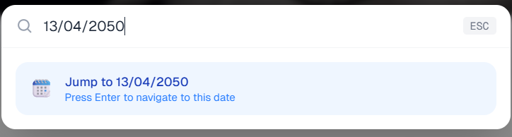
*Use the powerful search interface to enter dates from years into the future and instantly jump to that exact timeline.*

**8. Advanced Search Match**
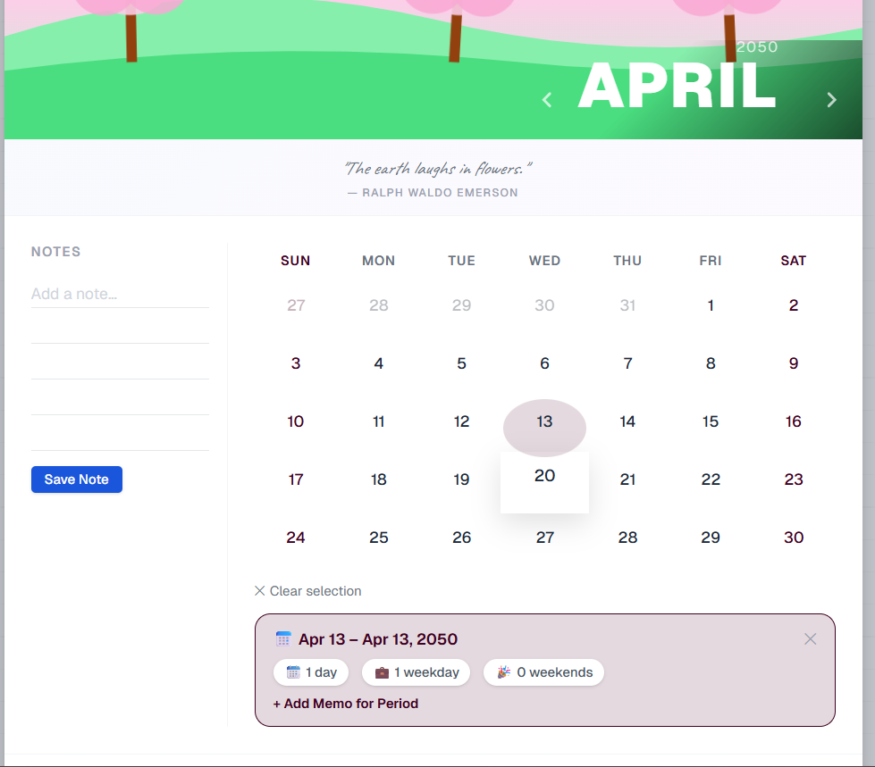
*Successfully rendering the calendar state anchored securely to the date queried in the search button.*

**9. Native Context Menus**
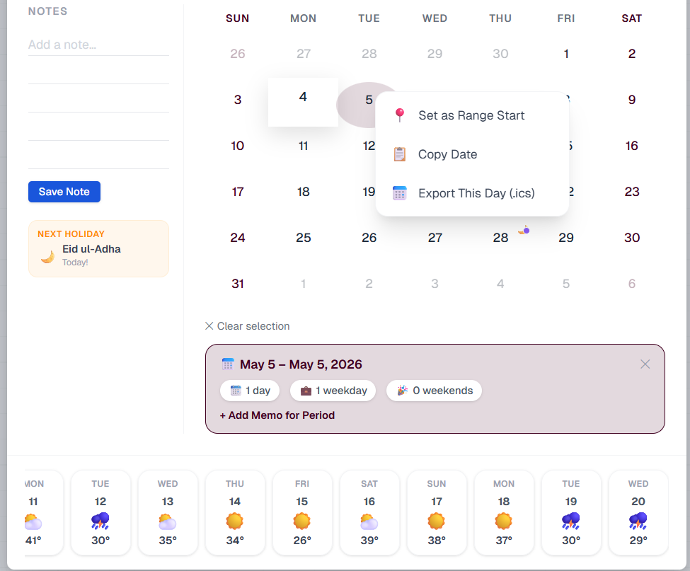
*Right-click directly on any particular date to reveal native options like 'Set as Range Start', 'Copy Date', and 'Export Data'.*

**10. Selection Boundaries bridging**
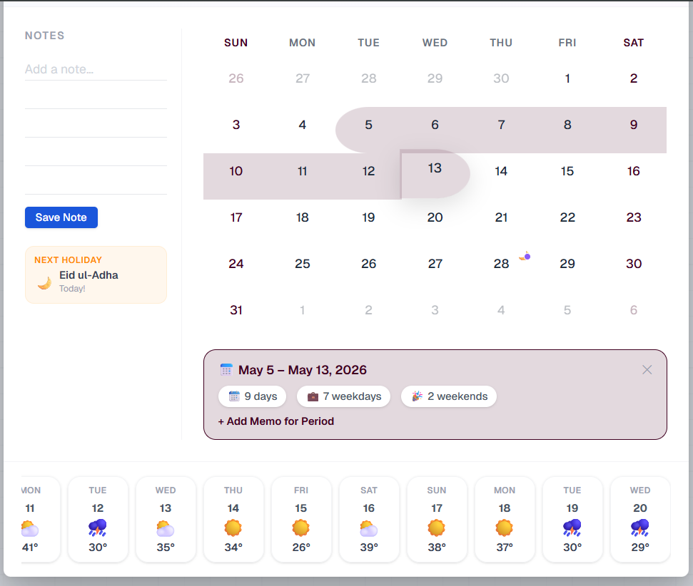
*Activate 'Set as Range Start' on one axis to define a selection anchor before clicking another distant date to complete the highlight.*

**11. ICS Export Engine**
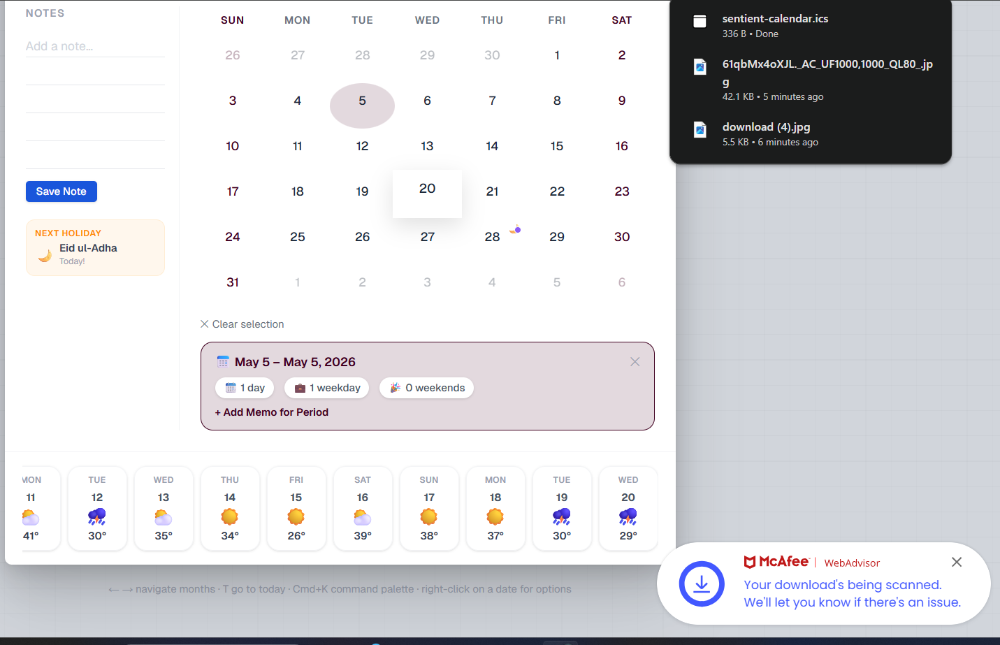
*Executing the 'Export Date' option directly from the context dropdown menu to parse localized calendar formats.*

**12. Isolated Month Architectures**
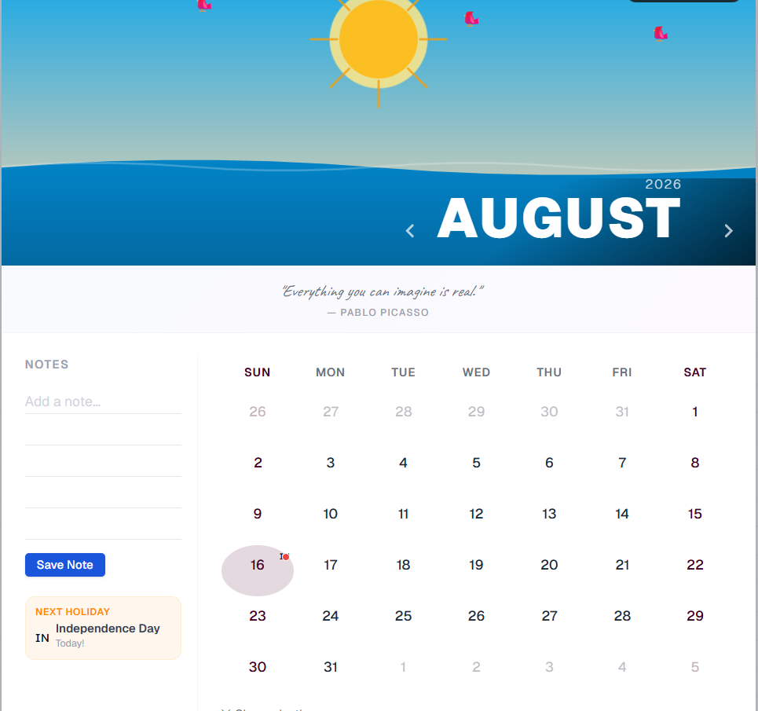
*Demonstrating isolated state persistence: navigating to another month proves that hero-section modifications apply strictly to localized months without overwriting others.*

---

## ✨ Novelty & "Stand Out" Engine (Creative Liberties)

To go beyond the baseline requirements, I built several proprietary UX hooks and micro-interactions designed to mimic physical objects:

### 1. 3D Page Flip Physics (`rotateX`)
Why settle for standard CSS fading? When users interact with the month navigation arrows, the calendar physically pivots. Utilizing `framer-motion`, the previous grid vanishes via a rigid `rotateX` translation anchored at the `transformOrigin: 'top'`—exactly as if a heavy piece of paper was flipped over the spiral binder.

### 2. Chameleon Color Extraction (AI-Lite)
When a user drops a new photo into the Hero Dropzone, the system reads the EXIF and pixel data through a lightweight canvas implementation, extracts the **dominant hexadecimal color**, and instantaneously re-themes the calendar's buttons, focus rings, dates, and backgrounds to coordinate with the newly uploaded photography. 

### 3. Command Palette (Spotlight Interface)
Pressing `Cmd + K` summons a MacOS Spotlight-style HUD overlay. This allows power users to instantly search for "Christmas", jump to `12/04/2026`, or rapidly trigger internal features without taking their fingers off the keyboard.

### 4. Deterministic Generative Engine
The bottom horizontal scroll-bar isn't using a mocked JSON file. It utilizes a deterministic pseudo-random engine seeded by UNIX timestamps to generate and cache logically consistent 100-year "weather" forecasts and dynamically compute moving global holidays (e.g. tracking when Easter falls).

---

## 🧠 Deep Dive: Frontend Architecture

The codebase adheres strictly to advanced composition patterns. No single file exceeds 200 lines to ensure hyper-maintainability.

### State Orchestration
Instead of fragile "prop-drilling", the app leverages **Zustand**. I isolated the state into two distinct stores:
1. `calendarStore`: Manages heavy, frequently updated data (date boundaries, arrays of cached dates).
2. `settingsStore`: Manages user configurations (High Contrast mode, starting weekday).
3. **Local isolation**: Pointer-dragging and high-frequency DOM manipulation during Range Selection bypasses React renders where possible, interacting directly with a localized `useRangeSelection` hook to prevent the entire tree from thrashing.

### Performance & Memory Management (60fps Target)
- **Memoization:** Arrays of `DateCell` components are wrapped in `React.memo` using strict customized equality checks since standard shallow compares fail on `Date` objects.
- **Render Bypassing:** Shadow trails and `boxShadow` generation strictly utilize Tailwind pseudo-classes (`hover:shadow-lg`) instead of JS-bound animation libraries to allow CSS GPU acceleration and avoid Framer Motion "NaN" string interpolation hurdles.

---

## 📂 Comprehensive Folder Structure

```text
📦 src
 ┣ 📂 components
 ┃ ┣ 📂 Calendar               # The Core Interaction Engine
 ┃ ┃ ┣ 📜 CalendarGrid.tsx       # 3D Flip container, coordinate boundary calculations
 ┃ ┃ ┗ 📜 DateCell.tsx           # Physics-enabled Node tracking hovering & pointer states
 ┃ ┣ 📂 Hero                   # Aesthetic Visual Anchors
 ┃ ┃ ┣ 📜 HeroSection.tsx        # LocalStorage drag-n-drop file parser & Dropzone
 ┃ ┃ ┣ 📜 FocalPointPicker.tsx   # Draggable crosshair dynamically updating CSS object-position
 ┃ ┃ ┗ 📜 MonthYearOverlay.tsx   # Animated clamp typography & primary navigation controller
 ┃ ┣ 📂 Notes                  # Persistent User Data Interface
 ┃ ┃ ┣ 📜 InlineNotesArea.tsx    # Daily localized scratchpad for global memos
 ┃ ┃ ┗ 📜 RangeNotesArea.tsx     # Context-aware sticky notes rigidly mapped to date spans
 ┃ ┣ 📂 UI                     # Global Layouts & Interactive Overlays
 ┃ ┃ ┣ 📜 CommandPalette.tsx     # Mac OS Spotlight interface intercepting Cmd+K events
 ┃ ┃ ┣ 📜 ContextMenu.tsx        # Absolute-positioned dynamic DOM dropdown hook
 ┃ ┃ ┣ 📜 HangingHook.tsx        # Custom aesthetic SVG anchor
 ┃ ┃ ┣ 📜 MonthlyQuote.tsx       # Monthly deterministic text injector
 ┃ ┃ ┗ 📜 RangeInfoBanner.tsx    # Metric aggregator parsing weekend/weekday computations
 ┃ ┗ 📂 Widgets                # Supplemental Data Modules
 ┃ ┃ ┗ 📜 WeatherBar.tsx         # Momentum-scrollable algorithmic weather ribbon
 ┣ 📂 hooks                    # Custom React Architecture
 ┃ ┣ 📜 useRangeSelection.ts     # Bounding box mathematics managing multi-select Pointer events
 ┃ ┣ 📜 useColorExtractor.ts     # Canvas manipulation algorithm sniffing dominant image HEX tones
 ┃ ┗ 📜 useIsMounted.ts          # Utility strictly preventing React hydration mismatch errors
 ┣ 📂 store                    # Global Zustand State Orchestration
 ┃ ┣ 📜 calendarStore.ts         # Middleware-persisted global tracking for heavy Date objects
 ┃ ┗ 📜 settingsStore.ts         # High-contrast, first-day-of-week, and locale overrides
 ┣ 📂 types                    # Global TypeScript Schema
 ┃ ┗ 📜 index.ts                 # Unified interfaces securing static compile-time safety
 ┗ 📂 utils                    # Pure Functional Algorithms (Zero side-effects)
 ┃ ┣ 📂 holidays               # Independent calculation nodes
 ┃ ┃ ┗ 📜 holidayCalculator.ts   # Advanced rules engine for floating localized holidays
 ┃ ┣ 📜 animations.ts            # Centralized Framer Motion spring physics variants
 ┃ ┣ 📜 dateRange.ts             # Mathematical logic for immutable JS Date conversions
 ┃ ┣ 📜 icsExporter.ts           # Protocol builder generating downloadable Appa .ics packages
 ┃ ┗ 📜 weatherSim.ts            # Unix-timestamp seeded deterministic temperature generator
📦 app
 ┣ 📜 globals.css              # Custom Tailwind v4 engine mapping & baseline CSS Variables
 ┣ 📜 layout.tsx               # Next.js Server-side metadata (Title & dynamic Favicon routes)
 ┗ 📜 page.tsx                 # The master assembly wireframe connecting stores to views
```

---

## 🛠️ Step-by-step Installation

To get this heavy-duty application running flawlessly on your localized machine:

1. **Clone the repository:**
   ```bash
   git clone https://github.com/Mayank2142/sentient-calendar
   cd sentient-calendar
   ```

2. **Install Node modules:**
   *(Ensure you are running Node v18+)*
   ```bash
   npm install
   ```

3. **Ignite the Turbopack server:**
   ```bash
   npm run dev
   ```

4. **Experience the Application:**
   Navigate to [http://localhost:3000](http://localhost:3000)

---

## 🕹️ Power User Guide (How to use)

- **Selection:** Left-click and drag your mouse across multiple dates. Watch the `RangeInfoBanner` calculate the data.
- **Customization:** Click the "Edit" pencil icon on the top `HeroSection` to upload an image from your computer. The UI will extract the colors. Drag the crosshair to set the CSS `object-position` focal point.
- **Context Menus:** Right-click ANY date inside the calendar to access a native-feeling context menu (Set Start, View Details, Clear).
- **Notepad Saving:** Type anywhere in the notepad and press "Save Note". You can completely refresh the browser tab, and your note will persist via Native Storage APIS.

---

## 📈 Future Scope & Integrations
Because the architecture decouple UI layers using robust Interface hooks and global stores, scaling this app requires minimal refactoring:
- **Serverless Postgres/Supabase:** Replacing `localStorage.setItem` with a REST call to a database would allow accounts and multi-device sync in less than 30 lines of code.
- **`date-fns-tz`:** Implementing proper timezone bounds to support collaborative international scheduling without DST drift.
- **iCal / Google OAuth:** The command palette is primed to accept third-party token scopes.

---

### 📝 License & Authorship
Designed, Engineered, and Developed with ❤️ by **Mayank** as a technology showcase. Released under the [MIT License](LICENSE).
